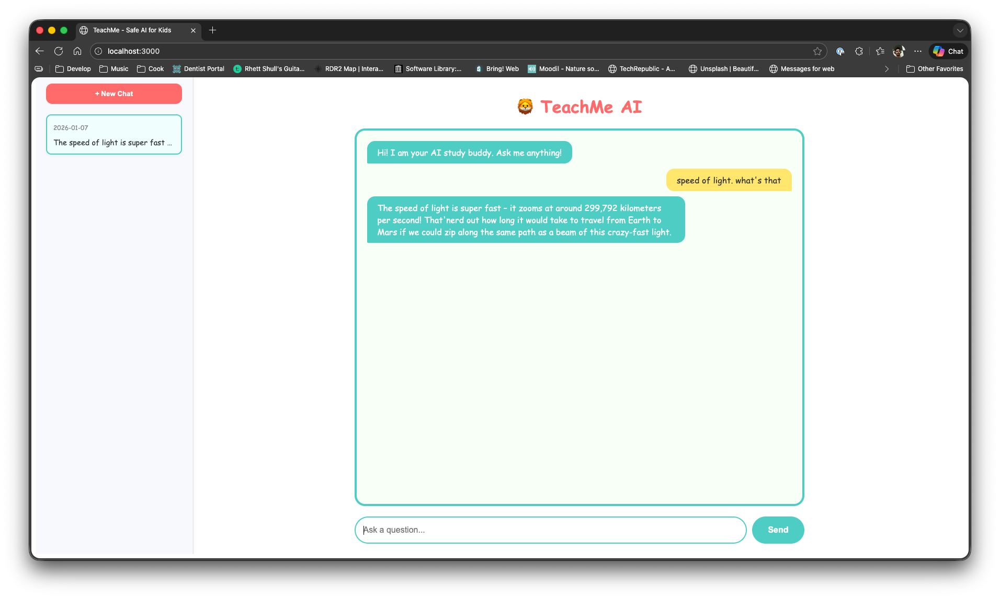

# 🦁 TeachMe AI

> ⚠️ **Disclaimer**: This project was entirely vibe-coded with AI assistance. While functional, it was built through iterative experimentation rather than rigorous engineering practices. Use at your own discretion and review the code before deploying in any production environment.

**TeachMe AI** is a safe, locally-hosted AI tutor and study buddy designed specifically for children. It acts as a friendly wrapper around powerful Large Language Models (LLMs), ensuring a controlled and educational environment for kids to ask questions, learn new concepts, and explore their curiosity without the risks associated with unmoderated internet access.



## 🚀 Purpose

In an age where AI is becoming ubiquitous, it is crucial to provide children with tools that are both educational and safe. Expensive subscriptions or cloud-based services often come with privacy concerns or lack specific safety guardrails for young minds. **TeachMe AI** solves this by:

* **Running Locally**: All data stays on your machine. No conversations are sent to the cloud.
* **Safety First**: The system prompt is engineered to be a "kind, patient, and safe AI tutor," explicitly instructed to refuse harmful or age-inappropriate topics.
* **Cost-Effective**: Uses open-source models (via Ollama) and free software, running on standard consumer hardware.
* **Simple UI**: A "kid-first" design with large text, playful colors, and an easy-to-use chat interface.

## ✨ Features

* **Safe Chat Interface**: A friendly, moderated chat experience powered by the `phi3` model (customizable).
* **Conversation History**: Automatically saves chats so kids can revisit previous lessons or fun conversations.
* **Organization**: Rename conversations to keep track of different topics (e.g., "Math Homework," "Dinosaur Facts").
* **Privacy**: Zero external data tracking. Everything is stored in a local MongoDB database.
* **Full Control**: Parents can easily delete conversations or reset the history.

## 🛠️ Technology Stack

This project is built with a modern, performance-oriented stack:

* **Backend**: [Go (Golang) 1.23](https://go.dev/) - Fast, strongly typed, and efficient.
* **Frontend**: [React](https://react.dev/) + [Vite](https://vitejs.dev/) - Responsive and snappy user interface.
* **Database**: [MongoDB](https://www.mongodb.com/) - flexible storage for chat logs and sessions.
* **AI Engine**: [Ollama](https://ollama.com/) - The easiest way to run LLMs locally.
* **Observability**: Prometheus, Grafana, Elasticsearch, Kibana, and Filebeat for metrics and logs.

## 🔒 Safety Layer

TeachMe AI implements a multi-layered safety system to protect children:

1. **Banned Words Filter**: Incoming requests and outgoing responses are checked against a configurable list of banned words (`backend/banned_words.txt`). Matches are blocked immediately.

2. **LLM Self-Moderation**: The system prompt instructs the AI to refuse harmful topics. When the LLM self-moderates, these responses are detected and logged for auditing.

3. **Request Statuses**:

   | Status        | Description                       |
   | ------------- | --------------------------------- |
   | `allowed`     | Request passed all safety checks  |
   | `blocked`     | Caught by the banned words filter |
   | `llm-refused` | LLM self-moderated its response   |

All safety events are logged with structured JSON and can be queried in Kibana or visualized in Grafana.

## 📊 Observability Stack

TeachMe AI includes a full observability stack for monitoring, metrics, and log analysis.

### Components

| Service           | Port   | Description                           |
| ----------------- | ------ | ------------------------------------- |
| **Prometheus**    | `9090` | Metrics collection and storage        |
| **Grafana**       | `3001` | Dashboards and visualization          |
| **Elasticsearch** | `9200` | Log storage and search                |
| **Kibana**        | `5601` | Log exploration and queries           |
| **Filebeat**      | -      | Ships container logs to Elasticsearch |

### Starting the Observability Stack

The full stack (including observability) starts with:

```bash
docker compose up --build
```

Or start only the observability services:

```bash
docker compose up prometheus grafana elasticsearch kibana filebeat
```

### Accessing Dashboards

* **Grafana**: <http://localhost:3001> (login: `admin` / `admin`)
  * Pre-configured dashboards in `Dashboards → TeachMe` folder
  * **TeachMe Overview**: Request rates, latency, success rates, status distribution
  * **TeachMe Safety & Logs**: Log counts, blocked requests, audit trail

* **Kibana**: <http://localhost:5601>
  * Query logs with: `json.app:"teachme-backend"`
  * Filter blocked requests: `json.status:"blocked"`
  * Audit LLM refusals: `json.status:"llm-refused"`

### Metrics Exposed

The backend exposes Prometheus metrics at `/metrics`:

* `teachme_requests_total{status, source}` - Total requests by status and source
* `teachme_request_duration_seconds` - Request latency histogram

## 🏁 Getting Started

### Prerequisites

* [Docker](https://www.docker.com/) & Docker Compose
* [Ollama](https://ollama.com/) installed on your host machine (or accessible via network).

### Installation

1. **Clone the repository:**

    ```bash
    git clone https://github.com/darkraiden/TeachMe.git
    cd TeachMe
    ```

2. **Pull the AI Model:**
    Ensure Ollama is running and pull the `phi3` model (or your preferred small/safe model).

    ```bash
    ollama pull phi3
    ```

3. **Start the Application:**
    Run the entire stack using Docker Compose:

    ```bash
    docker compose up --build
    ```

    Or simply using the Makefile:

    ```bash
    make docker-up
    ```

4. **Access the App:**
    Open your browser and navigate to `http://localhost:3000`.

### Usage

* **Ask a Question**: Type in the box and hit send!
* **New Chat**: Click `+ New Chat` to start a fresh topic.
* **Rename**: Hover over a session in the sidebar and click the **pencil icon** ✎ to give it a custom name.
* **Delete**: Hover over a session and click the **trash icon** 🗑️ to remove it.

## 🧪 Development & Testing

The project includes a `Makefile` to simplify common tasks.

* **Run All Tests**:

    ```bash
    make test
    ```

* **Run Backend Tests**:

    ```bash
    make test-backend
    ```

* **Run Frontend Tests**:

    ```bash
    make test-frontend
    ```

## 🤝 Contributing

Contributions are welcome! Whether it's adding a new feature, improving the safety prompts, or fixing a bug, feel free to open a Pull Request.

## 📄 License

[MIT License](LICENSE)
